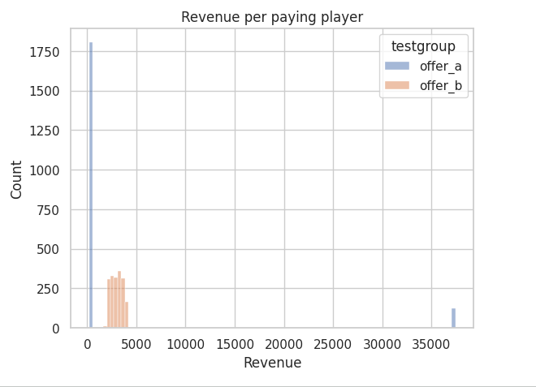
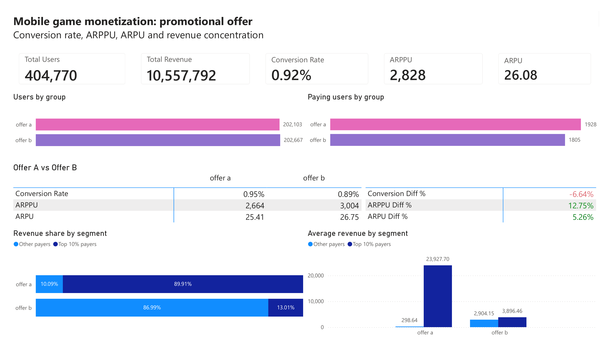

# Game Monetization & Player Segmentation

Revenue analysis of ~405,000 mobile game players.
Main question: how much of the game's revenue comes from how many players and does it change under a different promotional offer?

---

## Dataset

- **Source:** Kaggle — Gamelytics mobile game dataset (`ab_test.csv`)
- **Size:** 404,770 rows, one row per player
- **Fields:** `user_id`, `revenue`, `testgroup`

`testgroup` splits players across two promotional offers, labelled `offer_a` and `offer_b`, called **Offer A** and **Offer B** below. Revenue has no currency unit in the source data, so all figures are in raw revenue units.

The dataset has no dates, no offer descriptions and no information on how players were assigned to an offer. Everything is descriptive — the two offers are reported side by side, not tested against each other.

---

## Tools

BigQuery SQL · Python (Colab) · Power BI

---

## 1 — Data quality

404,770 rows and 404,770 unique user IDs, so one row is one player and nothing needed de-duplicating. No missing values, no negative revenue. The split between the two offers is 49.9% / 50.1%.

---

## 2 — Conversion rate, ARPU, ARPPU

| | Offer A | Offer B |
| --- | --- | --- |
| Players | 202,103 | 202,667 |
| Paying players | 1,928 | 1,805 |
| Conversion rate | 0.954% | 0.891% |
| ARPPU (spend per payer) | 2,664.00 | 3,003.66 |
| ARPU (revenue per player) | 25.41 | 26.75 |

**Roughly 1 player in 100 spends anything.** Across both offers, 3,733 of 404,770 players paid — 0.92%. The other 99% produce no revenue at all.

**Lower conversion is not automatically worse.** Offer B converted 6.6% fewer players in relative terms, but each payer spent 12.7% more, which nets out to a higher ARPU. Judging the two offers on conversion rate alone would point the wrong way.

---

## 3 - How payers spend (Non-payers are excluded)

| | Offer A payers | Offer B payers |
| --- | --- | --- |
| Minimum | 200 | 2,000 |
| Median | 311 | 3,022 |
| P90 | 393 | 3,796 |
| Maximum | **37,433** | 4,000 |

**The two offers have completely different price structures.** Offer A is cheap to enter — most payers spend around 300 — with a very long tail: one player spent 37,433. Offer B has a high floor and a hard ceiling near 4,000, so its payers are all worth roughly the same.



---

## 4 - Revenue segmentation

| Offer | Segment | Players | % of players | % of group revenue |
| --- | --- | --- | --- | --- |
| A | non_payer | 200,175 | 99.05% | 0.0% |
| A | payer | 1,735 | 0.86% | 10.1% |
| A | **top_10pct_payer** | **193** | **0.10%** | **89.9%** |
| B | non_payer | 200,862 | 99.11% | 0.0% |
| B | payer | 1,624 | 0.80% | 87.0% |
| B | **top_10pct_payer** | **181** | **0.09%** | **13.0%** |

**Under Offer A, 193 players generate 90% of the revenue.** That is 0.1% of the group. Under Offer B the same top-10% slice generates 13%, because its payers all sit inside a narrow price band.

**Similar totals, very different foundations.** The two offers earned 5.14M and 5.42M respectively, but one rests on a few hundred large spenders and the other on its whole payer base.

---



---

## Recommendations

- **Report the top payer group separately.** With 90% of Offer A's revenue coming from 193 players, an aggregate ARPU hides the movement that matters.
- **Judge offers on ARPU, not conversion rate.** The two components moved in opposite directions here.
- **Treat revenue concentration as a risk.** Offer A depends on a few hundred players; Offer B earns a comparable total from a base 10x wider.

---

## Limitations

- Descriptive only — no statistical test was run, so no difference between the two offers is claimed as proven or causal.
- Segments are defined by revenue, which is the outcome being studied. They show where revenue sits, not what caused it.
- The two offers' price ranges barely overlap, which suggests they are different product designs rather than a clean randomised split.

---

## What I would do next

**Check whether the two offer groups are actually comparable.** This dataset comes from the same source as the 'reg_data' and 'auth_data' tables which are analysed in a previous repository. Joining players back to their registration and login timestamps would show whether the two groups look alike on characteristics that existed before the offers — registration cohort, login frequency, time since signup. That is a balance check, not a test of the offers themselves, but it decides whether a test is meaningful at all: if the groups are comparable, the revenue comparison in this report can be re-run as a proper A/B test with a confidence interval. If they are not, that is the finding — the revenue gap would partly reflect who ended up in each group rather than what each group was offered.

---

## Repository

```
├── README.md
├── sql/
│   ├── 01_data_quality.sql
│   ├── 02_monetization_metrics.sql
│   └── 03_segmentation.sql
├── notebooks/
│   └── monetization_analystic.ipynb
├── dashboard/
│   └── monetization_segmentation.pbix
└── screenshots/
    ├── dashboard.png
    └── revenue_distribution.png
```

## How to run

1. Download `ab_test.csv` from the Kaggle link above
2. Load it into BigQuery as `ab_test`
3. Run `sql/01` through `sql/03` in order
4. Open `monetization_analystic.ipynb` for the same analysis in Pandas
